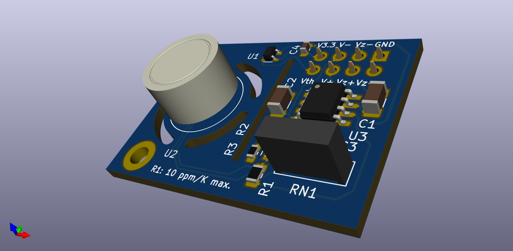
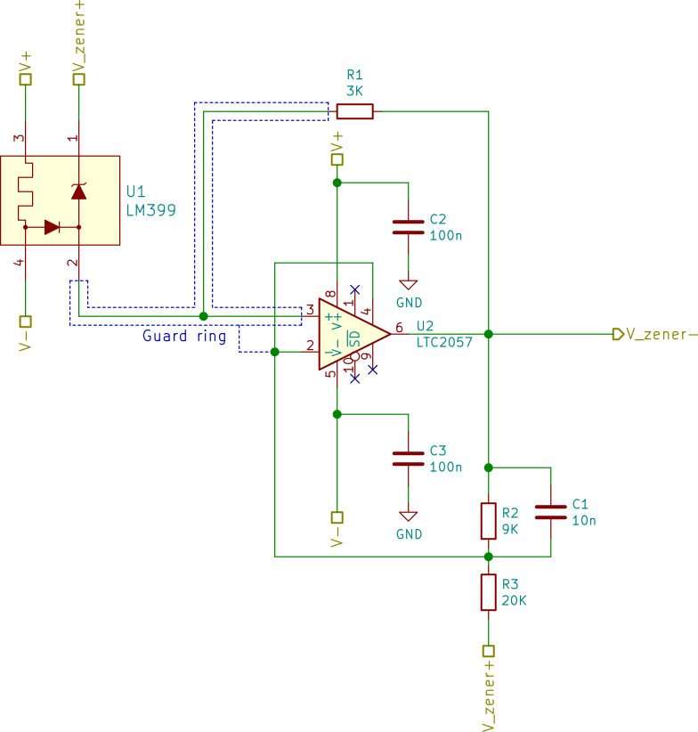

[](https://github.com/TU-Darmstadt-APQ/Voltage_reference/actions/workflows/ci.yml)
# LM399 Sub-ppm Reference Voltage

This repository contains the KiCAD PCB project files for a sub-ppm temperature coefficient __negative voltage reference__ used in the [digital laser driver design](https://github.com/TU-Darmstadt-APQ/DgDrive).



## Circuit description



This circuit utilizes the excellent [LM399](https://www.analog.com/en/products/lm399.html) voltage reference and outputs an amplified voltage of either -10 V or -15 V. There is no option to trim the output voltage as the absolute value is not that important, but stability is. The output voltage will be 10 V / 15 V __below__ the positive pin of the Zener diode.

The design is a self-biased circuit, which means the Zener diode bias current is produced by the Zener voltage and therefore as stable as the reference (neglecting the influence of the bias current on the Zener voltage as it is negligible). In order to keep the Zener self-heating of the diode as low possible, a Zener current of a little more than 1 mA was chosen for the  [LM399](https://www.analog.com/en/products/lm399.html).

Reference table for choosing the resistor values:

|Voltage | R1       |    RN1        |
|------------|-----------|---------------|
|-10 V      | 3k        | 20k /  9k  |
|-15 V      | 7.89k | 17k / 20k |

Different values are possible as well, but these values were readily available on Farnell/Mouser. When choosing a value for R1, choose a value as close as possible but always __less than or equal__ to the value given. This ensures, that the Zener current is at least 1 mA.

Single supply operation is possible as long the output voltage is larger than 0.1 V.

## Design Files
### For production
The design files required for the PCB production and assembly can be found on the [releases](../../releases) page and include the following resources:

- Schematics as a PDF
- Gerber files
- Pick & place position files
- Bill of materials as a CSV file and also as an interactive HTML version

The latest revision of those files can be found [here](../../releases/latest).

#### Variants
Two variants of the design files are provided for the user. There is a so-called *default* variant and a *PCBA* (Printed Circuit Board Assembly) variant.

##### Default variant
The default variant contains the full set of components and should be used for hand assembly when a set of binned and tested components is available. It includes both the Zener reference and resistive divider which need to be tested for popcorn noise and drift before installation.

##### PCBA variant
The PCBA variant should be used when sending the boards to the PCB manufacturer for assembly as they do not contain the [LM399](https://www.analog.com/en/products/lm399.html)/[ADR1399](https://www.analog.com/en/products/adr1399.html) Zener reference and the precision resistor array to amplify the output voltage. These components need to be binned prior to installation and should therefore not be placed by the board house.

### For editing
To work on the [KiCad](https://www.kicad.org/) design files, a number of external libraries are needed. Those libraries show up as empty folders in the zip file, because they are not included in the release, but must be downloaded separately from the links given [below](#related-repositories). This can be avoided by checking out the whole repository using git. This way the libraries will be downloaded as well. Use the following command to clone the git repository along with the submodules  using the `--recurse-submodules` flag.
```
git clone --recurse-submodules https://github.com/TU-Darmstadt-APQ/Voltage_reference
```

## Related Repositories
See the following repositories for more information as these are part of the [design files](#design Files).

- [KiCad footprints](https://github.com/PatrickBaus/footprints.pretty)
- [KiCAD 3D models](https://github.com/PatrickBaus/footprints.3dshapes)
- [KiCAD schematic libraries](https://github.com/PatrickBaus/KiCad-libraries)

## Versioning
I use [SemVer](http://semver.org/) for versioning. For the versions available, see the [tags](../../tags) available for this repository.

- MAJOR versions in this context mean a breaking change to the external interface of the hardware like different connectors or functions.
- MINOR versions contain changes to the hardware that only affect the inner workings of the circuit, but otherwise the performance is unaffected.
- PATCH versions do not affect the schematics or invalidate older bill of materials. These changes may include updated components (to replace obsolete parts for example), an updated silkscreen, or fixed typos.

## License
This work is released under the CERN-OHL-W
See [https://ohwr.org/cern_ohl_w_v2.pdf](https://ohwr.org/cern_ohl_w_v2.pdf) or the included LICENSE file for more information.
