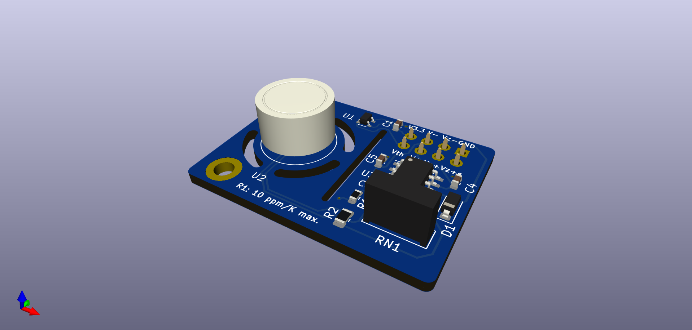

# LM399 Sub-ppm Reference Voltage

This repository contains the KiCAD PCB project files for a sub-ppm temperature coefficient __negative voltage reference__ used in our laser drivers.

## Circuit description

This circuit utilizes the excellent LM399 voltage reference and outputs and amplified voltage of either -10 V or -15 V. There is no option to trim the output voltage as the absolute value is not that important, but stability is. The output voltage will be 10 V / 15 V __below__ the positive zener voltage.

The design is a self-biased circuit, that means the zener diode bias current is produced by the zener voltage and therefore as stable as the reference (neglecting the influence of the bias current on the zener voltage, which is negligable). In order to keep the zener current as low possible, a zener current of a little more than 1 mA was chosen.

Reference table for choosing the resistor values:

|Voltage | R1       |    RN1        |
|------------|-----------|---------------|
|-10 V      | 3k        | 20k /  9k  |
|-15 V      | 7.89k | 17k / 20k |

Different values are possible as well, but these values were readily available on Ebay/Farnell/Mouser. When choosing a value for R1, choose a value as close as possible but always __less than or equal__ to the value given. This ensures, that the zener current is at least 1 mA.

Single supply operation is possible as long the output voltage is larger than 0.1 V.

## Design Files
The design files can be found on the [releases](../../releases) page and include the following resources:

- Schematics as a PDF
- Gerber files
- Pick & place position files
- Bill of materials as a CSV file and also as an interactive HTML version

The latest revision of those files can be found [here](../../releases/latest).

## Related Repositories
See the following repositories for more information as these are part of the [design files](#design Files).

- [KiCad footprints](https://github.com/PatrickBaus/footprints.pretty)
- [KiCAD 3D models](https://github.com/PatrickBaus/footprints.3dshapes)
- [KiCAD schematic libraries](https://github.com/PatrickBaus/KiCad-libraries)

## Versioning
I use [SemVer](http://semver.org/) for versioning. For the versions available, see the [tags](../../tags) available for this repository.

- MAJOR versions in this context mean a breaking change to the external interface of the hardware like different connectors or functions.
- MINOR versions contain changes to the hardware that only affect the inner workings of the circuit, but otherwise the performance is unaffected.
- PATCH versions do not affect the schematics or invalidate older bill of materials. These changes may include updated components (to replace obsolete parts for example), an updated silkscreen, or fixed typos.

## License
This work is released under the CERN-OHL-W
See [https://ohwr.org/cern_ohl_w_v2.pdf](https://ohwr.org/cern_ohl_w_v2.pdf) or the included LICENSE file for more information.
