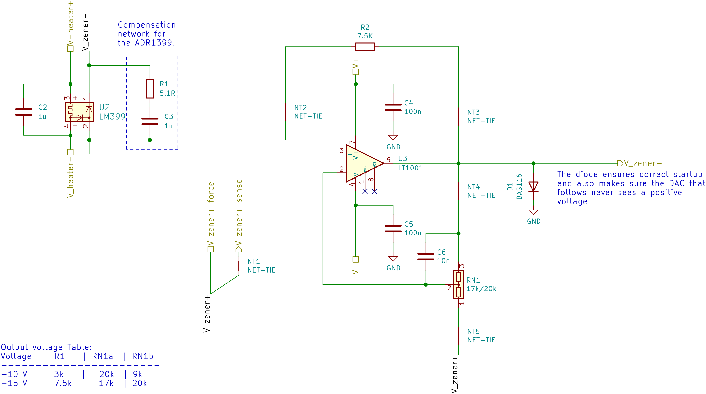

LM399 Sub-ppm Reference Voltage
===================

This repository contains the KiCAD PCB project files for a sub-ppm temperature coefficient __negative voltage reference__ used in our laser drivers.

About
-----
The root folder contains the KiCAD files and the bill of materials, while the gerber files can be found in the [/gerber](gerber/) folder.

Circuit description
-------------------

This circuit utilizes the excellent LM399 voltage reference and outputs and amplified voltage of either -10 V or -15 V. There is no option to trim the output voltage as the absolute value is not that important, but stability is. The output voltage will be 10 V / 15 V __below__ the positive zener voltage.

The design is a self-biased circuit, that means the zener diode bias current is produced by the zener voltage and therefore as stable as the reference (neglecting the influence of the bias current on the zener voltage, which is negligable). In order to keep the zener current as low possible, a zener current of a little more than 1 mA was chosen.

Reference table for choosing the resistor values:

|Voltage | R1    |    RN1    |
|--------|-------|-----------|
|-10 V   | 3k    | 10k /  9k |
|-15 V   | 7.89k | 17k / 20k |

Different values are possible as well, but these values were readily available on Ebay/Farnell/Mouser. When choosing a value for R1, choose a value as close as possible but always __less than or equal__ to the value given. This ensures, that the zener current is at least 1 mA.

Single supply operation is possible as long the output voltage is larger than 0.1 V.

Related Repositories
--------------------

See the following repositories for more information

KiCAD footprints: https://github.com/PatrickBaus/footprints.pretty

KiCAD 3D models: https://github.com/PatrickBaus/footprints.3dshapes

KiCAD schematic libraries: https://github.com/PatrickBaus/KiCad-libraries

License
-------

This work is released under the Cern OHL v.1.2
See www.ohwr.org/licenses/cern-ohl/v1.2 or the included LICENSE file for more information.
